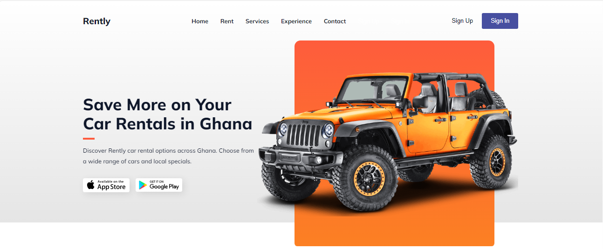

# Rently Car Rentals Website

## Overview

Rently provides a dynamic and responsive car rental platform in Ghana, designed for easy exploration, booking, and management of car rentals.

 
## Features

- **Responsive Design**: Works on desktop and mobile.
- **Interactive Navigation**: Mobile-friendly menu.
- **Car Rental Process**: Simplified steps for renting.
- **Service Overview**: Detailed service descriptions.
- **Customer Experience**: Highlights key benefits.
- **App Download**: Links for the Rently app.
- **Footer**: Additional links and social media icons.

## Project Structure

- `index.html`: Main HTML structure.
- `styles.css`: Styling for the website.
- `main.js`: JavaScript for interactivity.

## External Resources

- **Remix Icon**: [Link](https://cdn.jsdelivr.net/npm/remixicon@4.3.0/fonts/remixicon.css)
- **ScrollReveal**: [Link](https://unpkg.com/scrollreveal)
- **Google Fonts**: [Link](https://fonts.googleapis.com/css2?family=Mulish:ital,wght@0,200..1000;1,200..1000&display=swap)

## CSS

Includes root variables, global styles, typography, button styles, and responsive design.

## JavaScript

Handles the mobile menu toggle:

```javascript
const menuBtn = document.getElementById("menu-btn");
const navLinks = document.getElementById("nav-links");
const menuBtnIcon = menuBtn.querySelector("i");

menuBtn.addEventListener("click", () => {
  navLinks.classList.toggle("open");
  menuBtnIcon.setAttribute("class", navLinks.classList.contains("open") ? "ri-close-line" : "ri-menu-line");
});
